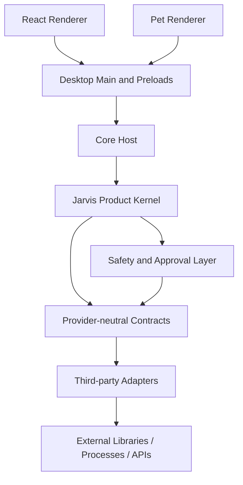

# Third-Party Trust Boundaries

Date: 2026-08-28

Audit HEAD: `8dc7b6db979b8b34f2301e0e12b28a1fbbbcea27`

Scope: design-only boundary document.

## Boundary Rule

Third-party libraries may provide bounded capability implementations. They must not become owners of Jarvis-K task state, credentials, permission decisions, memory writes, route selection, approval, or Windows execution semantics.

## Target Dependency Direction

Forbidden dependency direction:

- Renderer to third-party capability libraries
- Renderer to filesystem, shell, provider credentials, or plugin runtime
- Third-party agent framework to Jarvis Task Runtime
- Third-party memory framework to Jarvis memory write policy
- Third-party provider SDK to Windows Executor

## Ownership Matrix

| Concern | Owner | Third-party role |
| --- | --- | --- |
| Task creation and lifecycle | Jarvis Core | None |
| Planning/execution semantics | Jarvis Core | Plan proposal only |
| Approval and safety | Jarvis Core/Desktop/UI | None |
| Windows side effects | Desktop Host | Wrapped adapter only |
| Credentials | Desktop Main | Runtime-only injected secret |
| Cloud egress | Core policy + bounded transport | Request execution only |
| Memory writes/deletes | Jarvis memory policy | Retrieval/storage primitive only |
| Plugin permissions | Jarvis plugin runtime | Declared tool execution only |
| Skin rendering | Jarvis pet renderer | Asset-only package data |
| UI components | Jarvis design system | Headless primitives only |

## Adapter Contract

Every adapter must expose:

- Stable capability id
- Version and health projection
- Input/output schema
- Timeout, cancel, and dispose semantics
- No implicit retry or fallback unless Jarvis asks for it
- Sanitized error category
- Fake implementation for tests
- Disable/remove path

Every adapter must avoid:

- Direct credential persistence
- Arbitrary tool calls
- Automatic network egress outside endpoint policy
- Direct user-data persistence
- Raw prompt/response logging
- Shell or script execution

## Target Dependencies by Trust Zone

| Zone | Examples | Trust level |
| --- | --- | --- |
| Product Kernel | Core contracts, safety, task runtime | Trusted Jarvis code |
| Host Boundary | Electron Main, secure store, Windows execution | Trusted Jarvis code with OS access |
| Bounded Adapter | ASR, OCR, model, vector, browser, UIA wrappers | Untrusted until validated |
| Data Package | `.jkskin`, plugin manifests, model manifests | Untrusted input |
| External Service | GLM, DeepSeek, local model servers | Untrusted provider |

## Failure Containment

- Adapter failure must return a fixed error category and leave task semantics intact.
- Renderer failure must not leak credentials or bypass safety.
- Skin failure must roll back to built-in robot.
- Cloud failure must not auto-retry after response start and must never trigger tools.
- UIA or browser automation failure must not fall back to coordinate clicking unless explicitly approved by policy.

## Replacement and Rollback

Jarvis should be able to replace any adapter by:

- Disabling the capability in the registry
- Clearing health state
- Keeping user data in Jarvis-owned schemas
- Keeping credentials in Desktop-owned bindings
- Reverting to deterministic or built-in fallback paths
